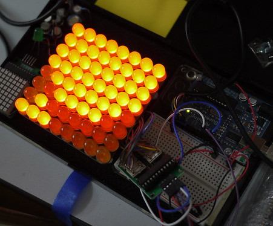

# Earth Demolition Simulator #

This is the source code for EarthDemSim, a game for the Arduino.
The display is a MAX7219-based 8x8 red LED matrix display from
Deal Extreme (SKU #184854),
and the game is controlled by an old NES controller.
There's no sound (yet).
Pin connections between Arduino,
display, and controller are shown in the source code comments.

I also wrote about the game on my blog:

http://anachrocomputer.blogspot.com/2013/06/another-tiny-game-on-arduino.html

## Ludum Dare ##

I wrote this game for Ludum Dare's MiniLD #42: 

https://web.archive.org/web/20180718170610/http://www.ludumdare.com/compo/2013/05/18/mini-ludum-dare-42-announcement/

The game is an Earth Demolition Simulator,
wherein the player shoots at the Earth from a spaceship.
All implemented in 2k of RAM on the Arduino,
and 64 pixels on the display.

On Github, there are two branches, "main" and "minild42".
"minild42" is the original code that I wrote for the MiniLD42
contest on Ludum Dare.
"main" is an updated branch that includes improvements that
I've added after the game deadline.
I'm still adding new stuff to the "main" branch.

## Screenshot ##

## UPDATE January 2018 ##

Changes to support V1.00 and newer Arduino IDE

Changes to coding standards

## UPDATE February 2018 ##

Slowed down NES controller reading code slightly to cure problems when
running on Arduino Nano clone board.

Removed obsolete SAA1064 (I2C) score display and replaced it with a
four-digit TM1637 display module.
Code now requires the TM1637 library and header file.
Scoring system unchanged,
so a winning game scores 1500 points.
Game still runs without TM1637 connected to Arduino.

